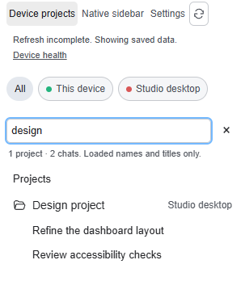
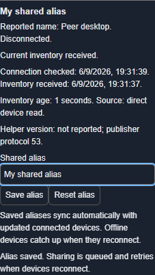
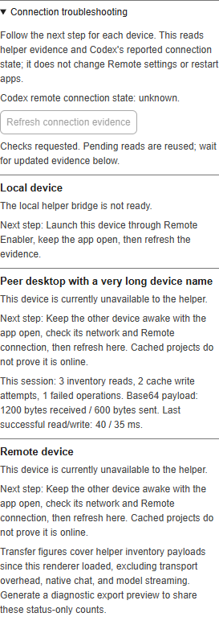
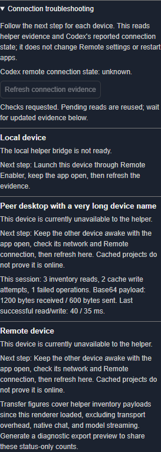
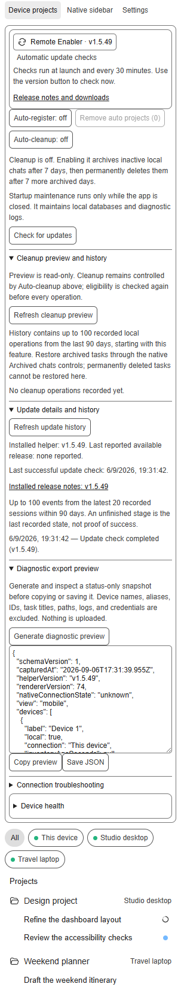

# Feature guide

This guide describes the Windows and macOS v1.5.63 source, including reliable
background inventory publication, loaded search, compact Settings, guarded navigation, and stale-Steer recovery. Historical v1.5.49 packages and
screenshots do not include those changes. Both packages share the Device
projects renderer and the feature behavior below; the
platform guides document their different launchers, setup assistants, proxy
options, and shortcut/startup commands.

Renderer v79 makes native offline state authoritative while retaining cached rows and runtime evidence; renderer v78 adds a parent-bound heartbeat for fully frozen hidden renderers; renderer v77 adds the background inventory reliability correction; renderer
v76 added the search and Settings improvements described below.

On Windows, each shortcut or sign-in launch verifies Remote Enabler recovery,
completes the official signed desktop MSIX update, completes the required
verified-Git Remote Enabler update, and only then starts compatibility probing
or injection. A running app, missing helper, unavailable update source, or
incomplete proof stops safely before launch.

Windows uses one permanent unversioned install root at
`%LOCALAPPDATA%\CodexRemoteFeatures\ChatGPT-Remote-Enabler-Windows-x64`.
Every Desktop, Start-menu, Startup, and logon-task entry point, including
legacy ChatGPT Custom aliases, is migrated there. Verified updates keep
rollback state in per-user updater storage and run long-lived task hosts from
hash-verified detached copies. Superseded version-named roots are removed only
after manifest, shortcut, task, process, live-coordinator, and recovery checks;
cleanup JSON identifies each removed or retained root.
The former unversioned ProgramData root is an exact legacy source and is
removed only after the same checks pass.

macOS uses the permanent unversioned per-user root
`~/Library/Application Support/CodexRemoteFeatures/ChatGPT-Remote-Enabler-macOS-arm64`.
An update from a recognized version-named release root copies the verified
installed manifest to that root, applies the new release there, rewires the
LaunchAgent and app shortcut, and removes the version-named roots. Successful
updates retain one immediate updater rollback and zero auxiliary or legacy
rollback copies, subject to active recovery-journal safety checks.

This preview uses synthetic data and is not a capture of the running ChatGPT app.

## Interface overview

**Device projects** and **Native sidebar** are switchable views. Device
projects keeps native folder styling, grouping, expansion, and ordering while
adding device filters. Synchronization continues when Native sidebar is
selected, and changing views does not change the native **By project** or **By
connection** preference.

| Feature | Behavior | Default or limit |
| --- | --- | --- |
| Device filters | Show All, This device, or one other known device. | Display-name order; cached inventory does not prove online state. |
| Find projects and chats | Search loaded project names and chat titles within the selected device filter. Matching projects include their loaded chats; matching chats reveal their project. | Case-insensitive literal words; no remote search or saved queries. Escape or Clear search restores normal expansion. Reordering is unavailable while searching. |
| Device names | Remember verified native or inventory names across reloads and restarts. | Unknown peers display **Remote device**; internal environment IDs are never labels. |
| Project rows | Show active projects, including empty projects, with native folder styling and project-hover new-chat actions when supported. | Last-known rows survive unavailable or incomplete refreshes with stale status; fresh authoritative membership determines removals. |
| Task state | Show a spinner while working and a blue unread dot after completion until viewed. | State and membership are refreshed independently; collapsed folders aggregate child state. |
| Quiet discovery | Discover remote projects and chats without opening registration dialogs or navigating away. | Applies even when an older installation enabled Auto-register; explicit project actions can still open native registration. |
| Force refresh | Rediscover connections and request fresh chat membership from connected devices. | Preserves the current chat, draft, filters, expansion, focus, and scroll; repeated requests are coalesced. |
| Sync status | Show concise refresh progress and stale-data status with a direct Device health shortcut. Last successful sync remains in the status tooltip and Device health. | A failed or incomplete read retains existing rows and does not renew inventory authority. |
| Remove auto projects | Remove registrations created by older Auto-register versions. | Manual registrations, chats, folders, and source data are kept. |

Keyboard focus and sidebar scroll position survive refreshes. Updates use a
persistent polite status region, larger controls, reduced-motion support, and
light/dark responsive layouts. Browser fixtures cover keyboard paths, reloads,
200% scaling, and compact panels; they are not a complete screen-reader or
WCAG certification.

The screenshots in this guide use synthetic browser fixtures and synthetic demo
data. They show the renderer's appearance and states; they are not native
Windows or macOS screenshots and are not proof of native app acceptance.

## Native Remote authorization, hosting, and reconnect

Native Remote owns authorization and connection preferences. The helper reads
those states and adds project inventory exchange; it cannot authorize a
computer, grant account access, or change native connection settings.

For the outgoing/controller role, open **ChatGPT/Codex → Settings →
Connections → Control other devices** and complete the native authorization
flow on that computer. If native state reports authorization, sign-in, or
access required, project synchronization pauses and the panel gives the
native next step. A saved name, cached project, or local publisher-ready flag
is not authorization proof.

For the incoming/publisher/host role, launch the helper-enabled desktop app on
each device whose projects should be visible and keep its authenticated Remote
connection available. The publisher shares active user-facing projects,
tasks, empty projects, and working/unread state through the existing Remote
channel. Internal exec and subagent work is used for local safety checks but
is excluded from user-facing project chats.

If native Remote exposes **Auto-connect** or an automatic reconnect setting,
change it in the native connection UI. The helper does not toggle that setting. A
native reconnect invalidates stale discovery, then the helper retries direct
reads and inventory; queued alias writes retry with bounded backoff. Cached
inventory remains useful fallback data but cannot mark an unavailable device
online.

## Settings and device health

Settings is available from both views and contains automation, cleanup, update,
diagnostic, health, and connection controls. Moving a control into Settings
does not change its stored preference; cleanup remains active in Native sidebar
when it was enabled.

In renderer v76, update status, Device health, and connection
troubleshooting come first. **Automatic cleanup** contains the cleanup switch,
its consequences, and removal of older auto-created project registrations.
Opening or closing this section never changes cleanup preferences. The loaded
version button checks for updates; the duplicate check button has been removed.

Search waits 120 ms after typing stops and filters the current loaded model.
It does not trigger inventory discovery per keystroke. Input composition,
keyboard focus, caret, and the existing chat draft are preserved. Search is
limited to names and titles already loaded by the helper, including cached
data whose freshness is shown separately; it does not search message bodies
or fetch unloaded history.

**Device health** shows each reported device name, native connection
availability, connection-check time, inventory age/source, publisher protocol,
and helper version when supplied by the peer. **Refresh devices** uses the same
refresh coordinator as **Force refresh**. Device filters expose their
connection state to assistive technology. Empty projects distinguish loading,
disconnected, stale/incomplete, and verified-empty states.

### Shared aliases

Set or reset an alias in Device health. It is stored locally and shared through
the existing authenticated peer inventory connection. Offline clients catch up
when they reconnect; newer edits win over older copies and simultaneous edits
resolve consistently. Reset is shared as a tombstone, so an old offline copy
cannot restore a cleared alias. The shared list is bounded to 100 devices.

Aliases change display labels only. They never replace device identity, native
reported names, connection settings, paths, or cache keys. Clearing local app
storage removes that client's copy, but peer synchronization can restore it;
use Reset when the shared alias should be cleared.

## Cleanup: read before enabling

**Auto-cleanup is off by default.** When enabled, eligible inactive, unpinned
local chats are archived after seven days and permanently deleted only after a
tracked seven-day recovery window in **Archived chats**. Selected, working,
pinned, remote, and insufficiently dated chats are skipped. Missing task or
pin evidence fails closed. Permanent deletion also requires a known managed
archive path and exclusive cross-window ownership.

Disabling cleanup clears timers; re-enabling starts a new recovery window.
Removing project registrations is separate and never deletes conversations or
source folders. Platform guides provide preview, enable, disable, and run
commands. Restore archived tasks through native **Archived chats**; permanently
deleted tasks cannot be restored by this helper.

In Settings, **Cleanup preview and history** provides a read-only snapshot of
archive/delete counts, up to 100 candidate titles per action, and a timestamp.
Preview does not enable cleanup, start timers, or mutate chats. Local history
retains up to 100 operations from the last 90 days, including incomplete runs,
with title, action, time, and an allowlisted reason for new entries. It stores
no task IDs or paths.

Before startup, the launcher performs best-effort local maintenance: it prunes
diagnostic logs older than seven days within a 96 MiB cap, checkpoints WAL
files, optimizes SQLite, and vacuums materially fragmented databases. It
skips physical maintenance while ChatGPT/Codex is running. Maintenance errors
are reported separately and do not block ordinary launch.

## Updates and rollback

The launcher checks at startup and every 30 minutes while the app remains open.
The loaded helper version is visible in Settings, including when the updater
sidecar is unavailable. An update is installed only after an explicit click.
The helper discovers stable Git tags and shallow-fetches the selected commit,
builds a deterministic local package, and pins its SHA-256 and file manifest.
Git is required; no hosted ZIP or GitHub API download is used by default. It
waits for authoritative idle activity, requests a graceful
close of the exact app instance, applies the files, and relaunches with saved
direct/proxy and startup options. Unknown activity keeps it queued; **Cancel**
is available until shutdown begins. A refused close is never force-killed.

Interrupted package replacement uses a durable journal and verified recovery.
Failed package updates restore the previous verified installation, and competing
or unknown writers block recovery. Clean `main` source checkouts fast-forward
to the pinned tag; recovery validates the original or completed commit without
resetting work. Dirty checkouts, other branches, and unexpected origins fail closed. Non-writable or administrator-owned folders show an
unavailable action; the helper never self-elevates. Automatic checks can be
disabled, and explicit `Update`/`update` commands remain available. GitHub forks can set `CHATGPT_REMOTE_UPDATE_REPOSITORY`. The explicit legacy
`CHATGPT_REMOTE_UPDATE_TRANSPORT=release` option uses hosted release assets and
accepts `CHATGPT_REMOTE_UPDATE_API_BASE` or `CHATGPT_REMOTE_UPDATE_LATEST_URL`;
it is never an automatic fallback. Corporate Git proxy and CA settings are honored.

**Update details and history** shows installed/available versions, the last
successful check, release-note links, and durable stages. History retains up to
100 events from the latest 20 sessions within 90 days and stores stage, version,
and timestamp. A replacement or restart-requested stage is not success;
relaunch confirmation is recorded only after readiness is acknowledged.

## Diagnostic export preview

Generate **Diagnostic export preview** in Settings and review the exact JSON
before choosing Copy or Save. Save uses the native Save As dialog where
available and confirms the selected path, cancellation, or failure. Nothing is
uploaded automatically; regenerate explicitly to refresh the snapshot.

The allowlist contains helper/renderer versions, pseudonymous device labels,
connection and inventory age/counts, cleanup settings/history count, and update
status/version/event count. It excludes real device names and aliases,
device/task IDs, task titles, paths, raw logs/errors, and credentials. The
preview is deliberately limited and is not a complete support log.

## Guided connection troubleshooting

Open **Settings → Connection troubleshooting**. Each discovered device gets
an evidence-based finding and next step, such as authorization/sign-in/access
required, disconnected, no recent check, publisher unavailable,
stale/incomplete inventory, cached fallback, outgoing-write retry, or healthy
direct reads. Local findings cover bridge, inventory, and publisher readiness.

**Refresh connection evidence** uses the same discovery and inventory refresh
as **Force refresh**. Refresh invalidates cached runtime discovery and bypasses
inventory retry delays for a fresh pass. Repeated clicks share the active
refresh; an older background read is followed by one fresh pass. If the app
has not exposed a runtime, the panel says that a direct
check could not start. Refresh does not change Remote settings, sign in,
elevate, install, or restart anything. Follow the suggested native step and
refresh again. Recent cached projects and status heartbeats never renew old
task membership authority; inventory authority expires after three minutes.

The panel also shows per-session read/write attempts, failures, payload bytes,
and last successful request timings. These cover helper inventory exchange, not
transport overhead, native chat, or model streaming.

## Inventory and synchronization limits

A green device indicator confirms connection reachability, not current project
inventory. A failed inventory read can therefore show a green device alongside
an incomplete-refresh warning. Cached rows remain available; if no rows have
been cached, the sidebar cannot treat missing inventory as proof of no projects.

Participating devices publish active inventory through the authenticated Remote
connection. Full inventory refreshes happen at startup, every 60 seconds, and
after detected task membership changes. Returning to the app refreshes stale
membership, and **Force refresh** requests an immediate fresh pass. Background
discovery never opens Add project, including when a connection cannot be
discovered quietly. Working/unread updates use the faster
activity cadence. Existing project registrations are kept until an explicit
user action removes them; stale or incomplete data retains the last known rows.

Peer-cache snapshots omit the recipient's echoed inventory and redundant
schema-v1 defaults. A slow peer has at most one active write and one newest
queued snapshot; intermediate snapshots are replaced. Failed writes retry with
bounded exponential backoff, while a timed-out unresolved write remains
locked and leaves direct reads available. Old queued snapshots expire after
three minutes.

A reproducible two-client fixture with 1,000 tasks per client reduced an
outgoing JSON snapshot from **392,392 to 141,178 bytes (64%)**. This measures a
fixture push payload, not total network traffic or live end-to-end speed. Run
`node windows/CodexRemoteMobileProject/tests/PeerTransfer.SelfTest.js` to repeat
that transport fixture.

## Privacy, prerequisites, and compatibility

The helper requires a supported signed-in desktop app with Remote available,
Node.js 22 or newer, Git for updates, and a writable per-user package folder. The core helper
adds no central catalogue, account entitlement, firewall exception, service,
scheduled task, or LaunchAgent. Optional sign-in startup setup may create the
platform's per-user startup integration. The helper uses the special-session
loopback debugger connection and private desktop internals, which can change
between app versions.

The package does not bypass authorization, MFA, workspace policy, server
permissions, or native enrollment. Windows includes compatibility handling for
existing protected enrollment state on affected app builds; that path does not
create authorization or rewrite the protected store. The platform guides
explain the compatibility path and the ordinary-app rollback path.

## Validation status

For the v1.5.54 remote-task changes, run
`node windows/CodexRemoteMobileProject/tests/TaskNavigation.SelfTest.js` and
the browser fixture below. These use synthetic runtimes and do not operate a
real account. After an approved deployment, two-Windows-client acceptance must
separately confirm that a new chat appears on the other desktop through polling
and Force refresh, without re-adding the connection, opening a registration
dialog, or disturbing a draft on that desktop.

Run `tools/Test-Source.ps1` with Node.js 22 or newer for runtime/renderer
fixtures, journal interruption/recovery, updater adapters, Windows native
window lifecycle, maintenance, and shared-source parity. Additional checks
include `tools/Test-UpdateSessionSurvivalWindows.ps1`,
`zsh tools/Test-MacOSUpdaterApply.zsh`, and the optional Playwright browser
commands documented in the root README.

Current v1.5.49 acceptance includes an ordinary Windows close/apply/recover/
relaunch update flow, an ordinary macOS restart flow on the preceding installed
build followed by manual v1.5.49 installation, and live v1.5.49 renderer
readiness on the participating test devices. Shared alias synchronization
converged across three clients. This does not certify every desktop-app build,
account policy, sign-in trigger, accessibility mode, or future release.

The screenshots in this guide are synthetic browser fixtures with synthetic demo
data. Release publication is not proof that a package is installed, a device
is authorized, a native connection is online, or a physical device has passed
acceptance.

