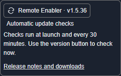
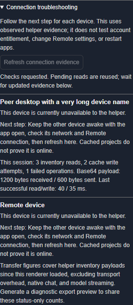
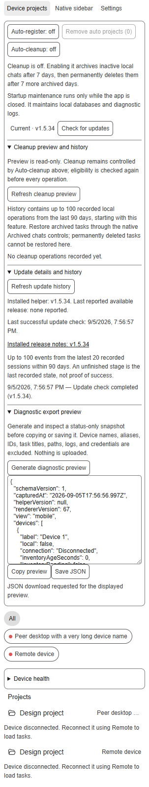

# Feature guide

## Everyday controls

| Feature | Behavior | Default or limit |
| --- | --- | --- |
| Device projects / Native sidebar | Switch between device-aware project grouping and native views. | Preserves native grouping and expansion; synchronization continues in both views. |
| Device filters | Show all devices or one selected device. | A cached inventory does not prove a device is online. |
| Device names | Remember verified names across reloads/restarts. | Unknown peers say **Remote device**; internal environment IDs are never the fallback. |
| Project rows | Include active empty projects, native folder styling/order and new-chat actions. | New-chat requires a usable command in the installed app. |
| Task indicators | Spinner while working; blue dot after completion until viewed. | Aggregate on collapsed projects; opening a remote task acknowledges it locally. |
| Auto-register | Mirror active remote project registrations locally. | Only fresh complete inventory can drive changes; no chat or source-folder deletion. |
| Remove auto projects | Remove registrations made by Auto-register and suppress immediate recreation. | Keeps manual registrations/chats/folders; **Allow auto-registration** reverses suppression. |

## Settings and device information

**Settings** is available in both views. It contains Auto-register, removal of automation-created registrations, Auto-cleanup, its permanent-deletion schedule, and update checks. Moving these controls does not change stored preferences. Cleanup stays active in Native sidebar if previously enabled.

**Device health**, inside Settings, shows reported device names, connection availability, and inventory freshness separately. Device filter buttons also expose their connection state to assistive technology. Empty projects distinguish loading, disconnected devices, stale inventory, and verified empty results.

Keyboard focus and sidebar scroll position are retained during refreshes. Update announcements use a persistent polite status region. Controls have larger targets and support reduced motion. Browser fixtures cover light/dark themes and 200% scaling; this is not a claim of complete screen-reader or WCAG certification.

## Updates

The update icon and **loaded helper version** are inside Settings in both views. The main sidebar keeps only the view switch, device filters, and projects; a small Settings indicator appears when an update needs attention. Click the version button for a manual update check. A missing update sidecar leaves the version visible with recovery instructions; an unavailable version is explicitly labeled rather than guessed.

**v1.5.36 is a normal release available to the existing automatic updater.** Earlier v1.5.32-v1.5.34 releases were incorrectly published as prereleases, which kept v1.5.31 clients from discovering them. The first Windows upgrade now bootstraps the new update helper even when the old launcher is finishing its startup code.

If a downloaded version is not visible, fully quit and launch from that extracted version's Remote Enabler launcher. A legacy **ChatGPT Custom** shortcut can still point at an older installation. A running app can also retain its older injected sidebar until relaunched.

Checks run asynchronously at launch and every 30 minutes while open. **Update available** appears inside Settings in both views. Queued updates explain the wait directly; technical errors have a details disclosure and a **Check again** action. Installation requires a click.

Clicking pins the selected release/checksum and prepares it while the app remains open. The helper waits for authoritative idle activity, including internal tasks. Unknown activity keeps it queued. **Cancel** is available until shutdown starts. Resumed work makes it continue waiting.

The helper rechecks write access and activity, requests a graceful close of the exact recorded process, applies verified files, and relaunches with saved direct/proxy and startup settings. Protected proxy configuration is reloaded; restart descriptors contain no proxy credentials. The initial startup delay and update check are skipped once on this relaunch. A different app instance appearing during the update is not replaced.

A refused close does not trigger force termination. Interrupted replacement uses a durable journal and verified recovery before another injection. A surviving file writer blocks competing recovery; unknown journal/lock ownership blocks the action. Failures appear in update status or a native notification and logs. A protected package folder must be moved to a writable per-user location or handled separately by its administrator; the helper never elevates itself.

## Optional cleanup: read before enabling

**Auto-cleanup is off by default.** When enabled, eligible inactive local chats are archived after seven days, then permanently deleted after a tracked seven-day recovery window in Archived chats. Selected, working, pinned, remote, and insufficiently dated chats are skipped. Permanent deletion also requires a known managed archive path and exclusive cross-window ownership. Missing evidence means skip.

Disabling cleanup clears its timers. Re-enabling starts a new recovery window. Preview commands in the platform guide show eligibility without changing chats. Removing project registrations is separate and never deletes conversations.

Physical startup maintenance prunes old diagnostic logs, checkpoints/optimizes SQLite and vacuums fragmented databases. It skips while the desktop app is running. Maintenance errors are reported without preventing ordinary launch.

## Synchronization and prerequisites

Participating devices publish active inventory through the app's authenticated Remote connection. Full inventory refreshes every 60 seconds and after detected task membership changes. Working/unread updates remain faster. Failed refreshes do not renew old authority; it expires after three minutes. Internal exec/subagent work is checked for update safety but excluded from user-facing project chats.

The helper requires a supported desktop app, a signed-in account with Remote, Node.js 22+, and a writable package folder. It adds no central catalogue, account entitlement or firewall exception. It uses the special-session loopback debugger connection and private desktop internals, which can change between app versions.

## Device health and local aliases

Open **Device health** to see the reported name, connection-check time, inventory age/source, publisher protocol, and helper version when supplied by the peer. **Refresh devices** coalesces requests and is limited to once every ten seconds; cached inventory is not proof of connectivity.

Set or reset a device alias in that panel. Aliases are stored only in this client's local storage, survive renderer reloads, and change display labels only. They never replace device identity, reported names, cache keys, or published inventory. Clearing the app's local storage removes them.

## Cleanup preview and history

In Settings, expand **Cleanup preview and history** and select **Refresh cleanup preview**. It lists archive and permanent-deletion counts, up to 100 candidate titles per action, and a snapshot time. Preview does not enable cleanup, archive/delete tasks, or start recovery timers. Complete task and pinned-task information is required; missing information makes preview unavailable. Actual cleanup always checks eligibility again.

Local history begins with this version and retains up to 100 operations from the last 90 days, including incomplete runs. Entries contain a title, action, and time, without task IDs or paths. New incomplete entries also contain an allowlisted reason; older entries explicitly lack detailed reasons. Earlier failures remain in history after recovery. Preview failures identify the missing service, pin information, timeout, or runtime change and clear stale preview results. A recorded operation follows a native command acknowledgement. Storage failure is shown and does not block cleanup. Restore archived tasks through native **Archived chats**; permanently deleted tasks cannot be restored here.

## Update details and history

In Settings, **Update details and history** shows installed/available helper versions, the last successful check, release-note links, and persistent update stages. **Refresh update history** rereads history without checking for updates or changing the queue. Older helpers that do not supply history show that limitation.

History contains up to 100 events from the latest 20 recorded sessions within 90 days. It stores only stage, version, and timestamp. A stage such as file replacement or restart requested is not success; relaunch confirmation is recorded only after the launcher acknowledges readiness. Corrupt records are ignored, and a history-write failure does not prevent an update.

## Diagnostic export preview

In Settings, expand **Diagnostic export preview** and generate a snapshot. Review the JSON before choosing Copy or Save; both use exactly the displayed snapshot. Save JSON opens the desktop app's native Save As dialog and saves the exact displayed UTF-8 JSON. The UI confirms the chosen path, cancellation, or failure, and allows only one save dialog at a time. Compatible browser environments use their file picker; unsupported environments explicitly offer Copy preview. Nothing is uploaded automatically. Regenerate explicitly to refresh it.

The allowlist includes helper/renderer versions, pseudonymous device labels, connection and inventory age/counts, cleanup settings/history count, and update status/version/event count. It excludes real device names and aliases, device/task IDs, task titles, paths, raw logs/errors, and credentials. This deliberately limited report is not a complete support log.

## Guided connection troubleshooting

Open **Settings → Connection troubleshooting** in either sidebar view. Each discovered device gets an evidence-based finding and next step: disconnected, no recent check, publisher unavailable, stale/incomplete inventory, cached fallback, outgoing-write retry, or healthy direct reads. Local findings cover bridge, inventory, and publisher readiness.

**Refresh connection evidence** requests the existing read-only discovery/inventory checks. Pending reads are reused and refresh is limited to once every ten seconds. If the app has not exposed a runtime for a listed device, refresh explicitly reports that a direct check could not start. It does not change Remote configuration, sign in, elevate, install, or restart anything. Follow the suggested step on the affected device and refresh again. Recent cached projects alone never prove a direct connection; status heartbeats do not renew old task membership.

The panel also shows per-session read/write-attempt counts, failures, base64 payload bytes, and last successful request timings. These figures cover the helper's inventory exchange, excluding transport overhead, native chat, and model streaming. The diagnostic preview includes only the finding code and status-only transfer counts/timings under pseudonymous device labels.

## More efficient inventory transfer

- Outgoing peer-cache snapshots omit the recipient's own echoed inventory while retaining other peers for forwarding.
- Nullable fields with identical schema-v1 defaults are omitted. Older helpers can read the same file format; no new endpoint or negotiated compression is required.
- Peer heartbeat timestamps no longer trigger an immediate publication echo. Idle task rows use the 15-second publication heartbeat; actual working activity uses five seconds. Content changes still trigger publication, and direct-read polling keeps its existing cadence.
- A slow peer gets at most one active write and one newest queued snapshot. Intermediate snapshots are replaced. Failed attempts use exponential backoff from two seconds up to one minute.
- A timed-out underlying write remains locked until its request settles, including through renderer reinjection. A permanently unresolved write blocks further pushes to that peer; the direct-read path remains available. Queued snapshots older than three minutes are discarded.
- Pull/push operations share configuration discovery. Failed reads retain the old acquisition timestamp and cannot make stale inventory authoritative.

A reproducible two-client fixture with 1,000 tasks per client reduced an outgoing JSON snapshot from **392,392 to 141,178 bytes (64%)**. This measures that fixture's push payload, not total network traffic or live end-to-end speed. Results depend on task metadata and peer topology. Run `node windows/CodexRemoteMobileProject/tests/PeerTransfer.SelfTest.js` from the repository to repeat the transport fixture.

## Validation status

Automated Windows native fixtures, real Chromium renderer/CDP integration, transaction interruption/recovery and source checks pass. Native macOS execution and full real-app update/relaunch acceptance remain pending. Release publication does not imply those tests are complete. See the release notes for exact tested boundaries.

Screenshots use synthetic browser fixtures; they are not native macOS acceptance evidence.
