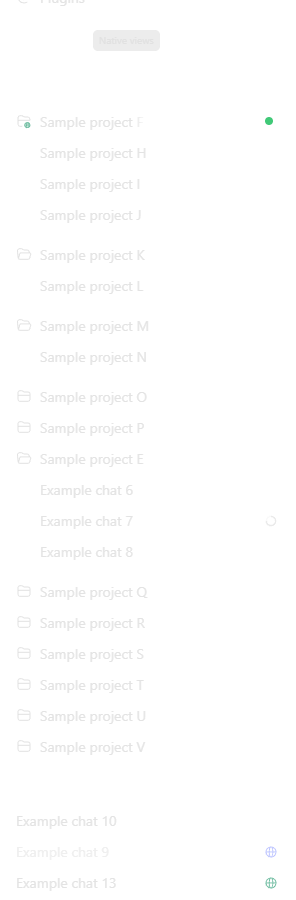
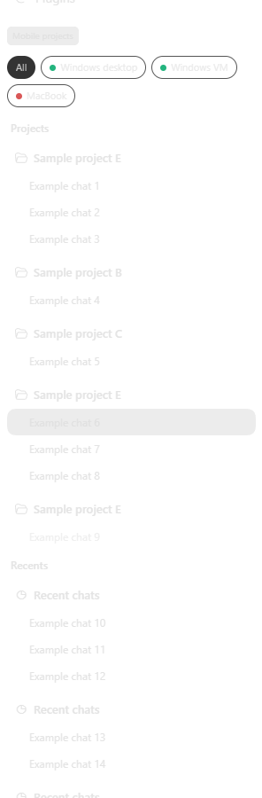

# ChatGPT Remote Enabler

Unofficial Windows and macOS helpers for ChatGPT/Codex Remote. Windows enables hidden native remote-device controls in affected desktop builds; both platforms can add a **Mobile projects** sidebar that groups chats by project and device, shows working/unread indicators, and can keep remote projects visible after their last chat is removed.

Why: some Windows builds contain the remote UI but do not expose it, and the native connection view flattens project organization. [OpenAI's Remote documentation](https://learn.chatgpt.com/docs/remote-connections) covers Mac and Windows and notes that availability depends on rollout and workspace settings.

| Native views | Mobile projects |
|---|---|
|  |  |

## Install

Download the archive for your platform from [Releases](https://github.com/belgian-coder/ChatGPT-Remote-Enabler/releases).

**Windows:** extract the archive to a permanent local folder and run `ChatGPT Remote Enabler.exe`, or run `windows\Enable-ChatGPTRemote.ps1` in PowerShell. Use `Disable-ChatGPTRemote.ps1` to restore the normal app. The launchers are unsigned and built from the included C# source. Optional Start-menu, Desktop, and at-logon setup is documented in [Windows details](windows/README.md).

**macOS Apple Silicon:** extract the archive, then run:

```zsh
chmod 755 ./MobileProjectView-macOS-arm64.sh
./MobileProjectView-macOS-arm64.sh enable
```

Run `./MobileProjectView-macOS-arm64.sh disable` to roll back. Node.js 22+ is required. macOS already supplies the native remote capability; its package only adds Mobile projects.

## Automatic injected startup

Keep the extracted package in a permanent local folder so the startup entry
continues to point at files that can be updated in place.

**Windows:** from the extracted `windows` folder, install a per-user startup
shortcut. Use `-UseProxy` when Remote needs the configured `HTTPS_PROXY` or
`HTTP_PROXY`; omit it for a direct connection.

```powershell
.\CodexRemoteMobileProject\StartupShortcut.ps1 -Action Install -UseProxy
.\CodexRemoteMobileProject\StartupShortcut.ps1 -Action Probe
```

The shortcut runs after interactive sign-in, launches the current `ChatGPT
Custom.exe`, injects both the stable Remote bridge and Mobile projects, and
does not require administrator rights. Remove it with `-Action Remove`.

**macOS Apple Silicon:** install the per-user LaunchAgent from the extracted
`macos` folder:

```zsh
chmod 755 ./MobileProjectView-macOS-arm64.sh
CODEX_STARTUP_DELAY_SECONDS=60 ./MobileProjectView-macOS-arm64.sh install-startup
```

The LaunchAgent starts the app and injects Mobile projects after login. Remove
it with `./MobileProjectView-macOS-arm64.sh remove-startup`.

## Auto-register remote projects

Renderer v42 mirrors the active saved-project list from each injected device, including while **Native views** is selected. Every device publishes its own current local-project metadata to `remote-project-inventory-v1.json` inside that device's Codex home. A connected controller reads the fresh file through ChatGPT Remote's existing authenticated filesystem channel, registers active projects (including projects with no chats), verifies the controller registration was persisted, and removes controller registrations that the host no longer lists. The controller reads its complete registered-project state directly rather than relying on currently rendered rows. It rehydrates Codex's native **By connection** lists on startup, sidebar changes, and every 30 seconds through their own expansion callbacks so older remote chats remain available with native navigation and actions. Grouping recovery follows native sidebar mutations and does not depend on background timers completing. Remote chats are grouped into the matching project by device and normalized path. Historical trusted paths and archived/removed projects are not inventory sources.

Install the injected startup on **the controller and every device being controlled**. Publication and refresh are automatic after sign-in; no shared server, NAS, or network share is required. Inventories older than three minutes are rejected, and a controller makes no automatic project changes when a connected host has not published a current v42 inventory.

- **Auto-register: on/off** enables or pauses automatic registration on this client. Existing registrations stay intact when switched off.
- **Remove auto projects (N)** removes only registrations created by this automation on this client. It stays visible but disabled at `(0)`, never deletes chats or source folders, and suppresses immediate recreation.
- **Allow auto-registration** appears in a suppressed project's right-click menu. It clears that local suppression so the project can be registered again.
- While auto-registration is on, controller registrations for a connected device mirror that device's active inventory; registrations absent from the fresh host inventory are removed without deleting chats or source folders.

Windows PowerShell equivalents:

```powershell
.\CodexRemoteMobileProject\MobileProjectView.ps1 -Action EnableAutoRegistration
.\CodexRemoteMobileProject\MobileProjectView.ps1 -Action DisableAutoRegistration
.\CodexRemoteMobileProject\MobileProjectView.ps1 -Action ReconcileAutoRegistrations
.\CodexRemoteMobileProject\MobileProjectView.ps1 -Action RemoveAutoRegistrations
```

macOS equivalents:

```zsh
./MobileProjectView-macOS-arm64.sh enable-auto-registration
./MobileProjectView-macOS-arm64.sh disable-auto-registration
./MobileProjectView-macOS-arm64.sh reconcile-auto-registrations
./MobileProjectView-macOS-arm64.sh remove-auto-registrations
```

The renderer still switches its hidden task inventory to **By connection** and
expands native **Show more** pages for complete chat discovery. Saved-project
discovery is separate and comes only from the fresh host-published inventory.

You can also drag projects within one device and chats within their current project. The saved order is delegated to ChatGPT instead of kept in a separate catalogue.

## Updates

Every normal or automatic launch checks GitHub Releases before enabling the custom view. A matching archive is installed only after its published SHA-256 and internal manifest pass. Failure keeps the installed version.

Opt out persistently with `Update-ChatGPTRemote.ps1 -Action DisableAutoUpdate` on Windows or `/bin/zsh ./Update-ChatGPTRemote.sh disable-auto-update` on macOS. Use `EnableAutoUpdate` / `enable-auto-update` to resume. Forks and mirrors can set `CHATGPT_REMOTE_UPDATE_REPOSITORY=owner/repo`, `CHATGPT_REMOTE_UPDATE_API_BASE`, or the complete `CHATGPT_REMOTE_UPDATE_LATEST_URL`; set `CHATGPT_REMOTE_AUTO_UPDATE=0` for one launch only. An optional positive `CHATGPT_REMOTE_UPDATE_INTERVAL_HOURS` value can throttle checks when desired.

This uses a loopback-only Electron debugging session and private renderer internals, so app updates can break it. It does not bypass account authorization, MFA, workspace policy, or server permissions.

## Privacy

Repository examples and screenshots use synthetic device, project, and chat names. Do not publish real hostnames, usernames, environment IDs, network addresses, local paths, or validation-machine names in issues, commits, release notes, screenshots, or packages.

See [Windows details](windows/README.md), [macOS details](macos/README.md), and [upstream attribution](windows/CodexRemoteSimple/UPSTREAM-NOTICE.md).
