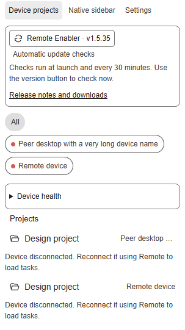
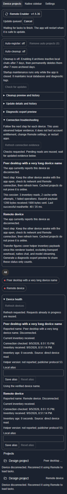

# ChatGPT Remote Enabler

Unofficial Windows and macOS helpers for ChatGPT/Codex Remote. Windows exposes hidden native remote controls in affected desktop builds; both platforms add a **Device projects** sidebar with device filters, project grouping, drag ordering, empty remote projects, project-hover new-chat actions, and synchronized working/unread indicators. Device Projects preserves the user's Native sidebar grouping preference.

| Device projects | Settings and update status |
| --- | --- |
|  |  |

## Install without administrator access

Download a platform ZIP from [v1.5.35 downloads](https://github.com/Belgian-Coder/ChatGPT-Remote-Enabler/releases/tag/v1.5.35), then follow its step-by-step guide:

- **[Windows 11 x64](windows/README.md)**: per-user folder, optional portable Node, double-click launch, Desktop/Start-menu shortcuts and optional sign-in shortcut.
- **[macOS Apple Silicon](macos/README.md)**: home-folder setup, optional portable Node, Terminal first launch, Dock shortcut and per-user sign-in startup.

Neither setup requires administrator permissions. A supported desktop app/account and Node.js 22+ are prerequisites; organization policies can still block execution. **v1.5.35 is a normal release. Native macOS acceptance and a full real-app update/relaunch remain pending.**

The **[feature guide](FEATURES.md)** explains controls, defaults, update behavior, and cleanup consequences. Both ZIPs include their installation and feature guides.

## Mobile-project buttons

Project rows reuse native folder icons and empty-project styling. Working and
unread indicators appear on expanded task rows and aggregate on collapsed
projects. Confirmed device names are remembered locally when metadata is
temporarily unavailable; unknown connectivity uses a neutral indicator.
Sidebar refreshes preserve keyboard focus, and unavailable native commands
are disabled. These adapters depend on private desktop internals, so behavior
on a future app build may require another compatibility update.

Unknown peers display **Remote device** until a verified device name arrives.
Verified names are remembered per device across restarts; native placeholder
labels cannot replace them. Full task inventories refresh every 60 seconds
and after detected task-list changes, while working/unread status continues
to refresh independently at its faster cadence.

- **Auto-register: on/off** mirrors active remote projects on this client, including empty projects. Enabling it only adds registrations; removal is always explicit.
- **Remove auto projects (N)** removes only registrations created by that automation. It never deletes chats or folders.
- **Auto-cleanup: on/off** optionally archives this device's inactive, unpinned local chats after seven days, then permanently deletes them after a tracked seven-day recovery window in **Archived chats**. It skips selected, working, pinned, remote, and insufficiently dated chats and defaults to off. Disabling it clears the timers, so re-enabling grants a new recovery window.
- A suppressed project's **Allow auto-registration** action permits automatic registration again.

PowerShell and macOS command equivalents:

```powershell
.\CodexRemoteMobileProject\MobileProjectView.ps1 -Action EnableAutoRegistration
.\CodexRemoteMobileProject\MobileProjectView.ps1 -Action EnableAutoMaintenance
.\CodexRemoteMobileProject\MobileProjectView.ps1 -Action DisableAutoMaintenance
.\CodexRemoteMobileProject\MobileProjectView.ps1 -Action PreviewAutoMaintenance
.\CodexRemoteMobileProject\MobileProjectView.ps1 -Action RunAutoMaintenance
```

```zsh
./MobileProjectView-macOS-arm64.sh enable-auto-registration
./MobileProjectView-macOS-arm64.sh enable-auto-maintenance
./MobileProjectView-macOS-arm64.sh disable-auto-maintenance
./MobileProjectView-macOS-arm64.sh preview-auto-maintenance
./MobileProjectView-macOS-arm64.sh run-auto-maintenance
```

## Updates and rollback

Launchers check asynchronously on every start and every 30 minutes while the
app remains open. **Update available · vX.Y.Z** appears beside the view controls
in both views. Updates install only after you click: the helper downloads and
verifies the selected release, waits for active work to finish, closes ChatGPT
normally, applies the update, and restarts with the same direct/proxy and
startup options. **Update queued** offers **Cancel** until shutdown begins.
Unknown activity keeps the update queued. An application that refuses to close
is never force-killed by the update action.

The session helper uses the existing loopback debugger connection and exits
with ChatGPT, except while completing an explicitly requested restart. It does
not install a service or scheduled task. A failed update recovers the previous
verified installation; an interrupted transaction is recovered before another
injected launch. Installation folders that require administration show an
unavailable action instead of changing permissions or self-elevating.

Explicit command-line `Update`/`update` remains available. Packaged installs
accept only a platform archive whose published SHA-256 and internal manifest
pass. Disable automatic checks with
`Update-ChatGPTRemote.ps1 -Action DisableAutoUpdate` or
`./Update-ChatGPTRemote.sh disable-auto-update`. Forks and mirrors can set
`CHATGPT_REMOTE_UPDATE_REPOSITORY`, `CHATGPT_REMOTE_UPDATE_API_BASE`, or
`CHATGPT_REMOTE_UPDATE_LATEST_URL`.

Before starting ChatGPT, the packaged launcher prunes diagnostic logs older than seven days (96 MiB cap), checkpoints WAL files, runs SQLite optimization, and vacuums materially fragmented databases. It always skips this physical maintenance when ChatGPT/Codex is already running. Maintenance errors are reported separately and do not prevent ordinary launch. Permanent chat deletion requires a known managed archive path and an exclusive cross-window lock.

Restore normal Windows ChatGPT with `Disable-ChatGPTRemote.ps1`; on macOS run `./MobileProjectView-macOS-arm64.sh disable`. See [Windows details](windows/README.md) and [macOS details](macos/README.md).

This project uses loopback Electron debugging and private renderer internals. It does not bypass account authorization, MFA, workspace policy, or server permissions. Examples, screenshots, packages, commits, and release notes must not contain real hostnames, usernames, environment IDs, network addresses, or private paths.

## Candidate validation

Run `tools/Test-Source.ps1` with Node.js 22 or newer on PATH. This includes
runtime and renderer fixtures, journal interruption/recovery, updater adapters,
Windows native-window lifecycle checks, maintenance, and shared-source parity.
The transaction fixture interrupts every durable operation boundary.

For Windows per-user package acceptance, run
`tools/Test-UserInstallWindows.ps1 -ArchivePath <Windows-release.zip>`.
It runs under the interactive user's Medium token (duplicating Explorer's token
when the parent is elevated), verifies extraction/write access and shortcut
install/probe/remove in isolated folders, exercises portable Node discovery,
and performs a read-only installed-app readiness check. It does not create a
fresh account, use real shortcut folders, launch/stop the app, or prove sign-in
execution. The fixture removes its own files on completion.

With Playwright available through `NODE_PATH`, optional Chromium integration
checks are `node tools/Test-RendererBrowser.cjs` and
`node tools/Test-UpdateSessionCdpBrowser.cjs`. They exercise the complete
renderer flow and real debugger bindings in isolated browser fixtures.

The v1.5.35 candidate has automated Windows and browser coverage. These tests
do not establish an actual ChatGPT update/relaunch. Full real-application startup,
quit, and update acceptance remains necessary before promotion to a stable release. Native macOS
execution, including `tools/Test-MacOSSupport.zsh`, is deferred until a Mac is
available; JavaScript parity and static contracts are checked on Windows.
## UX roadmap

The interface polish and per-user setup assistants are included in v1.5.35. See [the prioritized feature backlog](UX-ROADMAP.md) for ideas intentionally outside this release.

## Health, history, and diagnostics

Settings now includes cleanup preview/history, update details/history, and an explicit diagnostic export preview. Device health includes refresh, reported helper versions, and aliases that stay on this client. See the [feature guide](FEATURES.md) for retention and privacy boundaries.

## Connection troubleshooting and transfer

Settings now provides per-device connection findings, next steps, explicit evidence refresh, and session transfer statistics. Inventory exchange avoids recipient echoes, coalesces slow-peer writes, and retries with backoff. A 1,000-task-per-client fixture measured a 64% smaller push payload; live network speed is not yet measured. See the [feature guide](FEATURES.md) for scope and compatibility.
