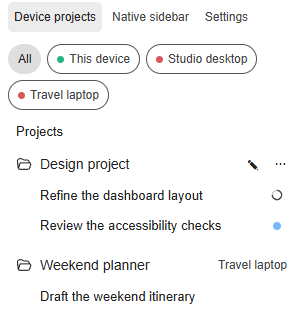
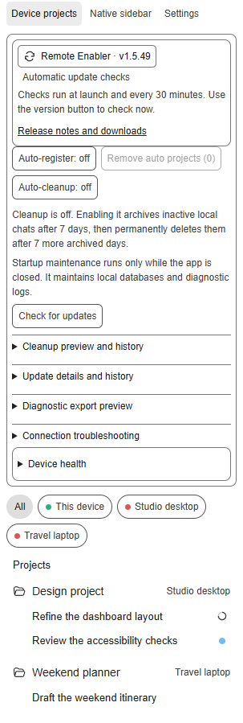

# Windows 11: install for your user without administrator access

Release v1.5.65 keeps the permanent helper in the current user's unversioned
LocalAppData root and migrates the v1.5.60 ProgramData root as legacy. Automatic
updates therefore replace files owned by the same limited user that owns the
shortcuts and updater state. Successful updates retain only the immediate prior
rollback generation and remove all legacy-recovery generations unless an active
recovery journal or live process still requires one. It retains renderer v79 and the ordered
desktop MSIX, Remote Enabler update, and launch gates. Installation and live
multi-device acceptance remain separate checks.

You need Windows 11 x64, the ChatGPT/Codex desktop app signed in with Remote available on your account, and Node.js 22 or newer. The special launcher can install or update the supported current-user desktop package from OpenAI's signed stable x64 MSIX while the app is closed; it does not unlock account features or bypass AppX policy.

## 1. Download and extract

1. Download **ChatGPT-Remote-Enabler-Windows-x64-v1.5.65.zip** from [v1.5.65 downloads](https://github.com/Belgian-Coder/ChatGPT-Remote-Enabler/releases/tag/v1.5.65). Read the verification limitations.
2. Right-click the ZIP in File Explorer, choose **Properties**, select **Unblock** if offered, and click **OK**. Then choose **Extract All**.
3. Enter `%LOCALAPPDATA%\Programs` in File Explorer's address bar. Create a **ChatGPTRemoteEnabler** folder and copy the extracted package contents into it.
4. **ChatGPT Remote Enabler.exe**, **README.md**, and **CodexRemoteMobileProject** must be directly inside that folder. Keep the whole package together.

This staging location belongs to your user. Avoid Program Files, WindowsApps, administrator-owned folders, and running inside the ZIP. Setup or first launch installs the verified payload at the permanent path described in step 4. Do not choose **Run as administrator**.

## 2. Node.js, if needed

Try step 3 first: the helper can use a suitable cached desktop-app runtime or Node already on PATH. If it reports Node.js missing:

1. Visit [the official Node.js download page](https://nodejs.org/en/download). Choose a supported LTS version, **Windows**, **x64**, and **Standalone Binary (.zip)**. You do not need the MSI installer.
2. Extract it. Copy the contents of the inner `node-v...-win-x64` folder into `%LOCALAPPDATA%\Programs\nodejs`.
3. Check that `node.exe` is directly inside `nodejs`, together with the other Node files. Try the helper again.

This portable location is detected automatically, including at sign-in. No PATH, registry, or system installation change is needed.

## 3. First launch

1. Finish active tasks and quit the ordinary ChatGPT/Codex app.
2. Double-click **ChatGPT Remote Enabler.exe** in your package folder.
3. Keep the network available while the launcher verifies recovery, completes the signed desktop-package update, and completes the verified-Git Remote Enabler update. Any failure stops before the app opens; the launcher never stops or kills a running app.
4. Wait for the app to open with **Device projects** and **Native sidebar** in its sidebar.
5. Set up the helper on each participating device, then connect devices through the app's normal Remote controls.

Unknown peers initially appear as **Remote device** until a verified name is available. The Windows launchers are unsigned: review their origin and release checksums if Windows blocks them. Organization policies may require IT approval independently of this helper. The normal workflow should not request UAC elevation.

## 4. Setup assistant: shortcuts and sign-in startup

Double-click **Setup.exe** in the extracted package. Choose **Recheck** to inspect app discovery, Node compatibility, package write access, integration files, and existing startup settings. The diagnostic preview contains status information rather than conversation content or credentials.

Select **Create Desktop and Start menu shortcuts** and/or **Start at sign-in**, then choose **Apply selected options**. Both are optional and unchecked initially. Existing legacy aliases are migrated to the permanent stable root even when both creation choices remain unchecked; unchecked choices do not create new shortcuts. Setup does not launch or restart the app. New shortcuts are called **ChatGPT Remote Enabler**; their underlying executable retains its compatibility filename.

**Open installation guide** opens this guide. **Copy diagnostic summary** copies the displayed preview. A successful package check does not prove live injection; launch readiness is checked when the enhanced app starts. Sign-in startup waits 60 seconds by default.

For a script-based setup, open ordinary PowerShell in the package folder and run:

```powershell
powershell.exe -NoProfile -ExecutionPolicy Bypass -File .\Setup-ChatGPTRemote.ps1
```

The existing DesktopShortcut and StartupShortcut scripts remain available for automation. No system execution-policy change is required.

The Windows install root is always the permanent unversioned path
`%LOCALAPPDATA%\CodexRemoteFeatures\ChatGPT-Remote-Enabler-Windows-x64`.
It is owned by the same Windows user that runs Setup and automatic updates.
Desktop, Start-menu, Startup, and **Codex Remote Mobile Features at Logon**
entries point there forever. Existing **ChatGPT Custom**, proxy-test, and old
Remote Enabler aliases are migrated in place with their proxy and startup
arguments preserved. The update manifest, VERSION, and launcher ProductVersion
are verified before files are replaced. `UpdateSessionTaskHost.exe` is copied
and hash-verified under
`%LOCALAPPDATA%\ChatGPTRemoteEnabler\launch-hosts` and
`%LOCALAPPDATA%\ChatGPTRemoteEnabler\update-sessions\launch-hosts`, outside
the stable root. Rollback journals and recovery copies stay under
`%LOCALAPPDATA%\ChatGPTRemoteEnabler\update`; superseded version-named roots
are removed only after shortcut, task, process, live-coordinator, and recovery
checks. The updater reports each cleanup as removed or retained with a reason.
The former unversioned ProgramData root is migrated and checked as a legacy
source alongside older version-named roots.

## 5. Updates and removal

**Update available** appears in both views. Click to prepare the verified release and queue it until work finishes. **Cancel** is available until shutdown starts. Saved networking/startup settings are restored on relaunch. See [the feature guide](FEATURES.md) for all controls and optional cleanup, which is off by default.

To remove your shortcuts and stop the helper, run from the permanent install
root:

```powershell
Set-Location "$env:LOCALAPPDATA\CodexRemoteFeatures\ChatGPT-Remote-Enabler-Windows-x64"
powershell.exe -NoProfile -ExecutionPolicy Bypass -File .\CodexRemoteMobileProject\StartupShortcut.ps1 -Action Remove
powershell.exe -NoProfile -ExecutionPolicy Bypass -File .\CodexRemoteMobileProject\DesktopShortcut.ps1 -Action Remove
powershell.exe -NoProfile -ExecutionPolicy Bypass -File .\Disable-ChatGPTRemote.ps1
```

Once stopped, you can delete the permanent install root and the downloaded
staging folder. Your conversations and projects are not deleted. Keep portable
Node if other applications use it.

## 6. ChatGPT desktop installation when Microsoft Store distribution is blocked

The Remote Enabler package and the ChatGPT/Codex desktop app are separate. The
Git checkout and portable ZIP methods above install only Remote Enabler; they do
not install the signed ChatGPT desktop package.

OpenAI's stable Windows x64 package is a Store-signed MSIX at
[`https://persistent.oaistatic.com/codex-app-prod/ChatGPT-x64.msix`](https://persistent.oaistatic.com/codex-app-prod/ChatGPT-x64.msix).
If the Store UI or its distribution service is unavailable, the repository's
updater can use that endpoint directly:

```powershell
powershell.exe -NoProfile -ExecutionPolicy Bypass -File .\Update-ChatGPTDesktop.ps1 -Action Probe
powershell.exe -NoProfile -ExecutionPolicy Bypass -File .\Update-ChatGPTDesktop.ps1 -Action Check
powershell.exe -NoProfile -ExecutionPolicy Bypass -File .\Update-ChatGPTDesktop.ps1 -Action Update
```

`Check` performs an HTTPS metadata request and does not download the large
package. A direct `Update` invocation is explicit. The Remote Enabler shortcut
and sign-in startup also invoke `Update` as their first package-changing gate,
before the required Remote Enabler Git update and before launch. Finish work
and close `ChatGPT.exe` first. The updater
refuses to stop or kill it, refuses equal versions and downgrades, checks the
manifest for the expected OpenAI identity, publisher and x64 architecture,
checks the package signature with Windows-native verification, and calls only
the current-user `Add-AppxPackage` path. It never provisions a machine-wide
package, requests elevation, or bypasses corporate policy. Use `-WhatIf` to
download and verify a candidate without installing it.

The updater recognizes both current-user package identities used by the Windows
app (`OpenAI.Codex` and the legacy `OpenAI.ChatGPT-Desktop`). It refuses an
ambiguous state where both identities are present and refuses to install a
different identity side by side. A missing package is reported as a fresh
current-user install case. The downloaded file is staged under the current
user's `%LOCALAPPDATA%\Temp\ChatGPTRemoteEnabler\msix-updater` directory and
removed after each attempt.

The direct package still uses Windows AppX/MSIX deployment. If the corporate
image blocks AppX, `Add-AppxPackage` will report the policy failure and the
updater will stop without a bypass. IT approval, an allowed deployment policy,
and any required offline license or MDM assignment are still needed. OpenAI's
desktop app has no standalone MSI or Store-independent EXE installer; its
built-in updater may also need HTTPS access to `persistent.oaistatic.com`.

## Troubleshooting

| What you see | What to do |
| --- | --- |
| Node.js missing | Check the location in step 2; `node.exe` must be directly inside `nodejs`. |
| No enhanced sidebar | Finish work, quit the ordinary app, and launch **ChatGPT Remote Enabler**. Read any compatibility error. |
| Stable install cannot write | Rerun Setup from a writable per-user staging folder. The permanent root is under your LocalAppData and requires no administrator access. |
| Startup does nothing | Allow the initial delay; an ordinary running app is left alone. |
| Update stays queued | Finish active tasks or Cancel. Unknown activity also keeps it queued. |
| Peer missing or called Remote device | Connect it and run the helper there; wait for fresh peer discovery. |
| Network needs a proxy | See the protected-proxy reference below. Home networking normally uses direct mode. |

Logs live in `%LOCALAPPDATA%\CodexRemoteFeatures` and `%LOCALAPPDATA%\ChatGPTRemoteEnabler\update-sessions`. Check logs for private information before sharing them.

## Advanced reference

Device Projects mirrors the native task-state indicators: a spinner while a task is working and a blue dot after it finishes until that task is viewed. Opening a remote task acknowledges that completion locally until its owning device reports the next state transition.

In Device Projects, **Auto-register: on/off** locally enables or pauses remote-project mirroring. It adds registrations and removes only automation-created registrations after a fresh, complete direct inventory confirms the source project was removed. It never deletes chats or folders. **Remove auto projects (N)** removes those registrations now and suppresses immediate recreation; it stays visible but disabled at `(0)`. Right-click a suppressed project and choose **Allow auto-registration** to permit it again.

Run `ChatGPT Remote Enabler.exe`, or open PowerShell here and run:

```powershell
.\Enable-ChatGPTRemote.ps1
```

The compatibility check runs first. Renderer v66 preserves the user's
**By project**/**By connection** Native sidebar preference and every folder's
open/closed state. It automatically paginates the authoritative active task
list for the app-server's interactive CLI/VS Code sources used by the desktop UI. Internal exec and subagent
runs remain available to maintenance safety checks but are not published as
project chats. Only native or persisted chat titles are published; preview and
first-message text is never treated as a title. The renderer publishes complete active projects, tasks, and working/unread state
into this device's Codex home. Other devices use direct peer reads plus local
per-device cache files if a request stalls. No folder opening, **Show more**
click, shared catalogue, or central storage is required. Empty active projects
appear while archived/removed projects and stale native rows do not. On app
builds that no longer expose the project-state bridge, the publisher uses the
current native local-project catalogue and refuses a false empty inventory
while that catalogue is unavailable. Inventory-only remote folders use the
same aligned folder geometry without an extra decorative marker.
When a connected device is still running an older publisher, its direct
user-facing task list takes precedence over that cached inventory so internal
child runs stay hidden during a staggered upgrade.
Verified user-facing task IDs are retained locally for seven days so renderer
reinjection and background refreshes keep the last correct list on screen.
An unverified device contributes no chat rows until its filtered
task query succeeds, preventing internal rows from flashing temporarily.
Device dots use current Remote runtime presence plus successful direct probes.
Cached peer inventory alone cannot mark an offline device as online; an online
device can remain green while its inventory service retries independently.
Renderer requests are time-bounded and retry after transient bridge failures;
cached projects remain visible with an offline dot while the owning device is unavailable.
Synchronization continues automatically when **Native sidebar** is selected.
Controllers read their complete registered-project state directly and verify
new registrations before recording success. Remote chats match projects by
device and normalized path, so they remain under the registered project.
The complete task inventory refreshes on startup and every 60 seconds, with
debounced refreshes after native task rows change. Working/unread status is
published separately at the existing fast cadence. Refresh does not open the
grouping menu or change its value. Hovering a
Device Projects folder opens the exact native project composer when available;
registered projects retain a native global-composer fallback when their folder
row is not mounted by the selected grouping.

Newer Windows builds include native remote-control device keys and disable
Electron main-process inspection. The launcher detects that capability and
uses only the loopback renderer bridge, avoiding a debugger-target timeout.
Older audited builds retain the legacy main-process shim. On a native-key
build, `-UseProxy` prepares a version- and hash-matched private runtime under
`%LOCALAPPDATA%\ChatGPTRemoteEnabler\patched-chatgpt`, starts it inside the
installed package context, and redirects only the Remote-control WebSocket to
a temporary localhost bridge. Signed enrollment and all ordinary APIs retain
the canonical `https://chatgpt.com` origin. The installed WindowsApps package
is never modified. Direct networking remains fully supported.

The launcher checks for an update asynchronously on every start and every
30 minutes while open. **Update available · vX.Y.Z** appears beside the view
controls in both views. Click to prepare that exact verified release and queue
the restart until active work, including internal tasks, finishes. **Cancel**
remains available until shutdown begins; unknown activity keeps the update
queued. The helper gracefully closes only the recorded ChatGPT process and
aborts if it does not exit. It restarts with the saved direct/proxy and
manual/startup options, reloading protected proxy settings without storing
credentials in the restart record.

The detached helper runs from per-user storage outside the installation folder,
uses the existing debugger connection, and exits with the app except during
the requested restart. It installs no service or scheduled task. Updates are
journaled and exclusively locked; launch recovers interrupted replacement
before reading the installed payload. Non-writable installations require
manual administration. Explicit command-line updates remain available:

```powershell
.\Update-ChatGPTRemote.ps1 -Action Probe
.\Update-ChatGPTRemote.ps1 -Action DisableAutoUpdate
.\Update-ChatGPTRemote.ps1 -Action EnableAutoUpdate
.\Update-ChatGPTRemote.ps1 -Action Update
```

Updates now use Git by default, even for extracted installations. Install Git and ensure its HTTPS access to the repository works. The updater lists stable tags, shallow-fetches the pinned commit, and builds/verifies a local package without downloading GitHub ZIPs or calling the GitHub API. Corporate Git proxy and certificate settings are honored. A clean source checkout on `main` fast-forwards to that verified tag; dirty work, other branches, or unexpected origins are preserved and refused.

Set `CHATGPT_REMOTE_UPDATE_REPOSITORY=owner/repo` for a GitHub fork. `CHATGPT_REMOTE_AUTO_UPDATE=0` disables background automatic checks, but it does not bypass the shortcut's required prelaunch Git update gate. The explicit legacy `CHATGPT_REMOTE_UPDATE_TRANSPORT=release` option enables hosted release assets for direct updater commands; the shortcut still requests Git and has no ZIP fallback. Older installed updaters need one manual Git-based upgrade before they can use this transport.

For a persistent local shortcut, keep the extracted folder in place and run:

```powershell
.\CodexRemoteMobileProject\DesktopShortcut.ps1 -Action Install
```

This creates one **ChatGPT Remote Enabler** shortcut on the Desktop and one in the
Start menu. It always runs the sibling stable and Device Projects bundles, so
future clicks recover and verify Remote Enabler, update the signed desktop
package, perform the required verified-Git helper update, and only then load
the injected view. Use
`-UseProxy` only when this device needs proxy mode; it configures those same
shortcuts with `--proxy`. The installer never creates a separate proxy
shortcut and recoverably removes obsolete proxy entries. First import the
existing User-scope proxy into DPAPI-protected local storage:

```powershell
.\CodexRemoteMobileProject\ProxyConfiguration.ps1 -Action Install -ImportUserEnvironment
.\CodexRemoteMobileProject\ProxyConfiguration.ps1 -Action Probe
```

The import copies the proxy into protected storage; it never removes or changes
User- or Machine-scope environment variables needed by other software. Older
audited ChatGPT builds clear only the launcher's process-local inherited proxy
variables and use an HTTP CONNECT tunnel only for the Remote-control WebSocket.
Native-key builds instead use a random per-launch localhost WebSocket bridge
because ChatGPT's bundled Node WebSocket client does not honor HTTP proxy
environment variables. The launcher makes a private copy of the currently
installed ChatGPT runtime, verifies exact source signatures, changes only its
Remote-control WebSocket URL selection, and disables embedded-ASAR integrity
checking only in that private copy so Electron can load it. The signed package,
canonical API base, enrollment challenge, and all other applications remain
unchanged. The bridge and background supervisor exit with ChatGPT, and stopped
older private runtimes are cleaned up automatically. TLS verification stays
enabled and includes certificates trusted by Windows. Proxy URLs containing
credentials are rejected, and probe output never exposes the proxy host. An
environment-variable fallback remains for older installations. Without
`-UseProxy`, the shortcut uses direct networking. If preparation, launch, or
injection fails, the launcher restores ordinary ChatGPT startup without the
targeted proxy shim.

```powershell
.\CodexRemoteMobileProject\DesktopShortcut.ps1 -Action Install -UseProxy
```

For automatic injected startup after sign-in, install a per-user startup
shortcut. This does not require elevation. Use `-UseProxy` on a VPN or network
where Remote requires the configured proxy; omit it for direct networking.

```powershell
.\CodexRemoteMobileProject\StartupShortcut.ps1 -Action Install -UseProxy
.\CodexRemoteMobileProject\StartupShortcut.ps1 -Action Probe
```

The installer replaces a disabled legacy startup shortcut after preserving a
rollback copy. Use `-Action Remove` to remove the active shortcut. The target is
the versioned `ChatGPT Custom.exe` in this folder. The launcher exits after
handing off startup, so a later user-requested update can replace it.
A manual **ChatGPT Remote Enabler** click is explicit
permission to replace an ordinary running ChatGPT session. Unattended startup
uses `--startup`, never terminates an active ordinary session, and records the
reason in `%LOCALAPPDATA%\CodexRemoteFeatures\startup.log`.

An elevated scheduled-task alternative remains available and now supports the
same proxy mode:

```powershell
.\CodexRemoteMobileProject\MobileProjectStartup.ps1 -Action Install -UseProxy -Confirm:$false
```

The task and shortcut both use the signed-in account and built-in Windows
PowerShell. They retry the stable bridge once when needed. Windows GUI startup
occurs at interactive sign-in, not before a user session exists.

Install the injected startup on both the controller and every controlled device.
After Remote first reports **Connected**, projects and chats can take several
seconds to populate. A fresh host inventory expires after three minutes; when
it is missing or stale, automatic project changes pause instead of using path
history. With mirroring enabled, controller registrations absent from the
host's active list are removed without deleting chats or folders.

Rollback:

```powershell
.\Disable-ChatGPTRemote.ps1
```

Automation controls are also available from PowerShell:

```powershell
.\CodexRemoteMobileProject\MobileProjectView.ps1 -Action EnableAutoRegistration
.\CodexRemoteMobileProject\MobileProjectView.ps1 -Action DisableAutoRegistration
.\CodexRemoteMobileProject\MobileProjectView.ps1 -Action RemoveAutoRegistrations
.\CodexRemoteMobileProject\MobileProjectView.ps1 -Action EnableAutoMaintenance
.\CodexRemoteMobileProject\MobileProjectView.ps1 -Action DisableAutoMaintenance
.\CodexRemoteMobileProject\MobileProjectView.ps1 -Action PreviewAutoMaintenance
.\CodexRemoteMobileProject\MobileProjectView.ps1 -Action RunAutoMaintenance
```

**Auto-cleanup** is off by default. When enabled, it uses the local Codex
app-server to archive unpinned, inactive local chats after seven days and to
permanently delete them after a tracked seven-day recovery window in Archived
chats. Existing archived chats receive a new seven-day window when first seen.
Disabling cleanup clears its timers. Selected, working, pinned, remote, and
insufficiently dated chats are skipped. Permanent deletion also requires a
known path under the local managed archive directory and an exclusive
cross-window lock; missing evidence is reported as skipped.
`PreviewAutoMaintenance` reports archive/delete eligibility without changing
anything. Before launching ChatGPT, the packaged launcher also prunes diagnostic
logs older than seven days (96 MiB cap), checkpoints WAL files, optimizes, and
vacuums materially fragmented SQLite databases. It skips physical maintenance
when any ChatGPT/Codex process is already running. The launcher uses
best-effort maintenance: failures are logged separately and launch continues.
Direct maintenance runs return a failing exit status on database errors.

Device names are resolved automatically from validated peer/native metadata
and remembered under normalized host identities. Synthetic native labels
cannot overwrite a verified name. A peer without a known name displays
**Remote device**, never its internal environment ID; restart and reinjection
use the same resolution path.

Node.js 22 or newer is required. The launchers do not modify WindowsApps, the
registry, firewall rules, or services. `ChatGPT Remote Enabler.exe` and
`CodexRemoteMobileProject\ChatGPT Custom.exe` are unsigned and compiled from
their included C# source files.

## Revised sidebar

These screenshots show the historical v1.5.49 renderer with synthetic demo data
in a browser fixture. They illustrate the interface; they are not native
Windows screenshots or proof of live Remote connectivity.





## Health, history, and diagnostics

Settings now includes cleanup preview/history, update details/history, and an explicit diagnostic export preview. Device health includes refresh, reported helper versions, and aliases shared automatically with updated connected clients. See the [feature guide](FEATURES.md) for retention and privacy boundaries.

## Connection troubleshooting and transfer

Settings now provides per-device connection findings, next steps, explicit evidence refresh, and session transfer statistics. Inventory exchange avoids recipient echoes, coalesces slow-peer writes, and retries with backoff. A 1,000-task-per-client fixture measured a 64% smaller push payload; live network speed is not yet measured. See the [feature guide](FEATURES.md) for scope and compatibility.

## Version or update icon missing

Check the target of **ChatGPT Custom** in the Start menu (open its file location, then shortcut Properties). Setup preserves legacy shortcuts, so one may still launch a different, older folder. Downloading a ZIP into a new folder does not retarget that shortcut.

Fully quit the app when your work is safe, then use **ChatGPT Remote Enabler.exe** in the newly extracted folder, or the new **ChatGPT Remote Enabler** shortcut created by that folder's setup assistant. Open Settings to see the loaded helper version and update controls in either view. A missing update service shows recovery instructions there.

v1.5.65 is a normal release and is discoverable by the existing automatic updater. The first Windows upgrade from v1.5.31 attaches the new update helper even through the legacy launcher.


### Existing enrollment keys after a Codex update

The Windows compatibility path detects an enrollment that still matches the
older Remote Enabler DPAPI key store. On the next normal launch, it prepares a
version-matched private runtime that tries Codex's native key provider first
and uses the existing protected key when the native provider cannot find it.
New keys use the native provider. This does not create or authorize an
enrollment and does not rewrite the existing key store. Server-side revocation
and authorization checks still apply.

The compatibility copy lives under `%LOCALAPPDATA%\ChatGPTRemoteEnabler\patched-chatgpt`. The installed WindowsApps files remain unchanged. Without proxy mode, only the device-key loader changes; network destinations and challenge validation remain original. The private copy disables embedded ASAR integrity validation to load the reviewed compatibility code, and the launcher verifies its source/runtime/helper hashes before reuse. Use the ordinary Codex shortcut to return to the unmodified installed runtime; revoke a device through native settings before deliberately deleting its protected key material.

Device labels are now collected from Codex's connection catalog even for devices with no tasks. A saved label or local publisher-ready status is not proof of an authorized connection. If Codex still requests authorization, complete its native Settings > Connections > Control other devices flow. The helper resumes discovery after the connection state changes.

Verification for v1.5.49 uses source checks, isolated protected-key fixtures,
mocked package launches, headless browser fixtures, and an ordinary Windows
close/apply/recover/relaunch update flow. Live v1.5.49 renderer readiness was
checked on the participating test devices. Native Remote authorization still
belongs to the app's **Settings → Connections → Control other devices** flow.
Do not launch a second copy of Codex against a running user session: Windows
can forward that invocation to the existing window.
